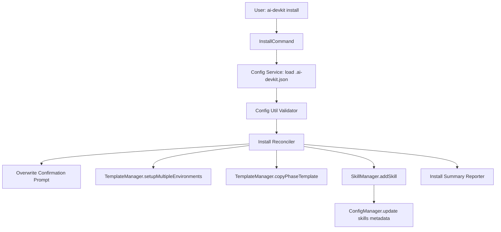

# System Design & Architecture - Install Command

## Architecture Overview

**What is the high-level system structure?**



**Key components and responsibilities:**

- `install` command handler: orchestrates install lifecycle.
- `InstallConfig Validator`: validates environments, phases, and optional skills.
- `Install Reconciler`: computes desired state vs existing files.
- `TemplateManager` integration: applies environment and phase templates.
- `SkillManager` integration: installs skills from config entries.
- `Overwrite Confirmation Prompt`: when destination artifacts already exist, ask user to confirm replacement.
- `SkillConfigSync`: ensures `ai-devkit skill add` writes skill metadata back to `.ai-devkit.json`.
- `Reporter`: emits per-section summary and final exit status.

## Data Models

**What data do we need to manage?**

```typescript
interface DevKitInstallConfig {
  version: string;
  environments: EnvironmentCode[];
  phases: Phase[];
  skills?: Array<{
    registry: string;
    name: string;
  }>;
  createdAt: string;
  updatedAt: string;
}
```

- Existing fields continue unchanged.
- New `skills` field is optional for backward compatibility.
- Duplicate skill entries deduplicated by `registry + name`.

## API Design

**How do components communicate?**

**CLI surface:**

- `ai-devkit install`
- Optional follow-up flags (proposed):
  - `--config <path>` (default `.ai-devkit.json`)
  - `--overwrite` (overwrite all existing artifacts without additional prompts)

**Internal interfaces (proposed):**

```typescript
async function installCommand(options: InstallOptions): Promise<void>;
async function validateInstallConfig(config: unknown): Promise<ValidatedInstallConfig>;
async function reconcileAndInstall(config: ValidatedInstallConfig, options: InstallOptions): Promise<InstallReport>;
```

**Output contract:**

- Section summaries for environments, phases, and skills.
- Final totals: installed/skipped/failed.
- Exit codes:
  - Invalid/missing config: `1`
  - Valid config with success: `0`
  - Partial skill-install failures: `0` with warning output and failed item details.

## Component Breakdown

**What are the major building blocks?**

1. `packages/cli/src/commands/install.ts` (new): top-level command execution.
2. `packages/cli/src/services/config/config.service.ts` (new): load config file from disk.
3. `packages/cli/src/util/config.ts` (new): schema validation and normalization.
4. `packages/cli/src/services/install/install.service.ts` (new): reconcile and apply installation.
5. `packages/cli/src/lib/Config.ts` (update): persist/read `skills` metadata.
6. `packages/cli/src/lib/SkillManager.ts` (update): on successful `addSkill`, sync skill entry into `.ai-devkit.json`.
7. `packages/cli/src/cli.ts` (update): register `install` command and options.

## Design Decisions

**Why did we choose this approach?**

- Reuse existing managers (`TemplateManager`, `SkillManager`) for consistency and lower risk.
- Add `install` as separate command instead of overloading `init` to keep intent clear:
  - `init`: configure project interactively/template-first.
  - `install`: apply existing project config deterministically.
- Keep new config field optional to avoid breaking older projects.
- Existing artifacts require explicit user confirmation before overwrite (safe interactive default).
- Partial skill failures do not fail the whole install run; command exits `0` and reports warnings for failed items.

## Non-Functional Requirements

**How should the system perform?**

- Performance: install should scale linearly with configured phases and skills.
- Reliability: each section continues independently and reports failures.
- Security: validate config values before filesystem/network actions.
- Usability: actionable errors that point to field names and file path.
