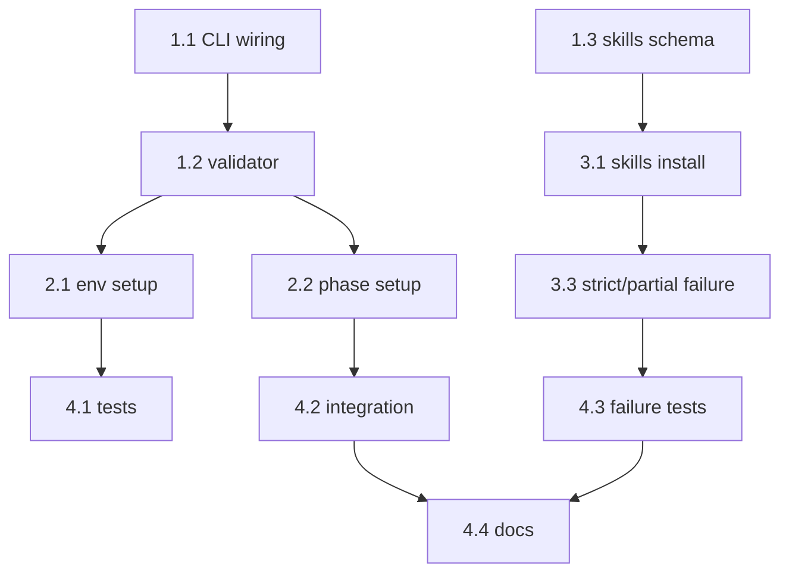

# Project Planning & Task Breakdown - Install Command

## Milestones

**What are the major checkpoints?**

- [x] Milestone 1: Requirements/design approved for `ai-devkit install`.
- [x] Milestone 2: Core install flow (config read + env/phase reconcile) implemented.
- [x] Milestone 3: Skill install integration + tests + docs completed.

## Task Breakdown

**What specific work needs to be done?**

### Phase 1: Foundation

- [x] Task 1.1: Add `install` command wiring in `packages/cli/src/cli.ts`.
- [x] Task 1.2: Implement install config validator for `.ai-devkit.json`.
- [x] Task 1.3: Define backward-compatible skills schema (`skills[]` optional).
- [x] Task 1.4: Add install report model (installed/skipped/failed counters).

### Phase 2: Core Features

- [x] Task 2.1: Implement environment setup from `environments` using `TemplateManager`.
- [x] Task 2.2: Implement phase setup from `phases` using `TemplateManager`.
- [x] Task 2.3: Add idempotent handling for existing artifacts.
- [x] Task 2.4: Add `--overwrite` behavior and conflict messaging.

### Phase 3: Skills Integration

- [x] Task 3.1: Implement skills install loop from config skills entries.
- [x] Task 3.2: Deduplicate skill entries by `registry + name`.
- [x] Task 3.3: Add partial-failure handling with warning-only skill failures.
- [x] Task 3.4: Update config types/read-write paths for optional `skills` field.

### Phase 4: Validation & Docs

- [x] Task 4.1: Unit tests for config validation and normalization.
- [x] Task 4.2: Integration tests for full `ai-devkit install` happy path.
- [x] Task 4.3: Integration tests for missing config, invalid config, and partial failures.
- [x] Task 4.4: Update README/CLI help/changelog with usage examples.

## Dependencies

**What needs to happen in what order?**

## Timeline & Estimates

**When will things be done?**

- Phase 1: completed
- Phase 2: completed
- Phase 3: completed
- Phase 4: completed
- Remaining estimate: 0 day

## Risks & Mitigation

**What could go wrong?**

- Risk: Existing `.ai-devkit.json` files lack `skills`.
  - Mitigation: keep field optional and treat as empty array.
- Risk: Skill installs fail because of network/registry issues.
  - Mitigation: continue on error and collect warnings with clear per-skill failure details.
- Risk: Overwrite policy causes accidental template replacement.
  - Mitigation: default skip existing artifacts unless `--overwrite` is enabled.

## Resources Needed

**What do we need to succeed?**

- Existing CLI command framework (`commander`).
- Existing managers (`ConfigManager`, `TemplateManager`, `SkillManager`).
- Test harness for command-level tests.
